# Document Intelligence Platform
**A production-oriented multimodal RAG system that turns complex business documents into grounded answers, structured insights, and review-ready signals.**

## Problem Statement
- Enterprises still spend significant time manually reading **invoices, contracts, reports, spreadsheets, and scanned documents** to answer simple but high-value questions.
- Traditional search and OCR pipelines often fail on **tables, visual content, noisy scans, and follow-up questions**.
- The result is slower operations, inconsistent review quality, and limited traceability for finance, legal, compliance, and operations teams.

## Solution Overview
- This project delivers an end-to-end **Document AI / Generative AI pipeline** for business documents.
- It ingests text-heavy and visually rich files, converts them into searchable context, applies **hybrid retrieval**, and generates **grounded LLM answers with source citations**.
- The system also supports **structured extraction, anomaly review, conversation memory, and answer quality signals** to make outputs more usable in real workflows.

## Key Features
- **Multiformat ingestion** for `PDF`, `DOCX`, `DOC`, `XLSX`, `XLS`, `CSV`, `TXT`, `PNG`, `JPG`, and `PPTX`.
- **Multimodal understanding** using a VLM for charts, diagrams, embedded tables, screenshots, and scanned pages.
- **Hybrid retrieval pipeline** that combines `BM25`, dense embeddings, and a **cross-encoder reranker** for higher-quality context selection.
- **Grounded question answering** with document-only prompting, source attribution, and follow-up conversation support.
- **Confidence and faithfulness scoring** surfaced in the UI to make answers easier to review.
- **Structured extraction mode** for entities such as dates, organizations, money amounts, invoice references, email addresses, and phone numbers.
- **Anomaly review mode** for spotting unusual numeric values in invoices and tabular documents.
- **Persistent local vector store** with ChromaDB so indexed documents survive app restarts.
- **Production-minded resilience** through backend auto-detection, model fallbacks, local embedding fallback, and graceful degradation when optional components are unavailable.

## Tech Stack
- **Languages & Frameworks:** Python, Streamlit
- **LLM / VLM Serving:** Hugging Face Inference Providers, OpenRouter, OpenAI-compatible client
- **LLMs:** `meta-llama/Llama-3.1-8B-Instruct`, `mistralai/mistral-7b-instruct:free`
- **Vision Models:** `Qwen/Qwen2.5-VL-7B-Instruct`, `qwen/qwen-2.5-vl-7b-instruct:free`
- **Embeddings & Reranking:** `all-MiniLM-L6-v2`, `cross-encoder/ms-marco-MiniLM-L-6-v2`
- **Retrieval:** ChromaDB, BM25 (`rank-bm25`)
- **Document Parsing:** PyMuPDF, python-docx, openpyxl, python-pptx, Pillow
- **Chunking:** LangChain `RecursiveCharacterTextSplitter`
- **NLP / Extraction:** spaCy, regex-based pattern extraction
- **OCR (optional):** PaddleOCR
- **Dev & Ops:** pytest, Docker, docker-compose, python-dotenv, loguru

## System Architecture

```mermaid
flowchart LR
    A["Business Documents"] --> B["Ingestion Layer<br/>PDF / DOCX / XLSX / CSV / Images / PPTX"]
    B --> C["Visual Understanding<br/>VLM or OCR for scans, charts, tables"]
    C --> D["Semantic Chunking<br/>LangChain Recursive Splitter"]
    D --> E["Embedding + Indexing<br/>Sentence Transformers + ChromaDB"]
    E --> F["Hybrid Retrieval<br/>BM25 + Dense Search + Cross-Encoder"]
    F --> G["Grounded Generation<br/>LLM with source-aware prompting"]
    G --> H["Outputs<br/>Q&A, extraction, anomaly review, confidence signals"]
```


- **Pipeline design:** the system is organized into six clean stages, which keeps the code modular and easier to extend.
- **Scalability posture:** embeddings and reranking run locally, while LLM/VLM calls are abstracted behind provider-agnostic configuration, making the stack easier to move between environments.
- **Reliability decisions:** ChromaDB persists indexes on disk, the pipeline can rebuild chunk state after restart, and retrieval gracefully falls back when BM25 or reranking is unavailable.
- **Cost-aware architecture:** retrieval-heavy components run locally, reducing API dependence to the parts that benefit most from remote models.

## How It Works
1. **Upload a document** through the Streamlit interface.
2. **Detect file type and content type** using the ingestion layer.
3. **Process visual pages** with a VLM, or OCR if needed, to recover information from scans and image-heavy content.
4. **Chunk the extracted text** into retrieval-friendly segments while preserving natural structure.
5. **Embed and index chunks** into ChromaDB for persistent semantic search.
6. **Retrieve relevant context** using BM25 and dense search, then rerank the merged candidate pool.
7. **Generate a grounded response** using only retrieved document context.
8. **Return answer + sources + quality signals** in the UI, with optional extraction and anomaly outputs.

## Installation & Setup
### Local Setup
```bash
git clone <your-repo-url>
cd doc_intelligence

python -m venv .venv
```

**Activate the environment**
- **Windows:** `.venv\Scripts\activate`
- **macOS / Linux:** `source .venv/bin/activate`

```bash
pip install -r requirements.txt
python -m spacy download en_core_web_sm
```

### Environment Configuration
```bash
copy .env.example .env
```

Add one provider key to `.env`:
- **Hugging Face:** `HF_API_KEY=hf_...`
- **OpenRouter:** `OPENROUTER_API_KEY=sk-or-...`

Optional model overrides:
- `LLM_MODEL=`
- `VLM_MODEL=`

### Preflight Validation
```bash
python run.py --setup
```

### Run the App
```bash
python run.py
```

Open `http://localhost:8501`

### Docker
```bash
docker-compose up --build
```

## Usage
### Core Workflow
- Upload a document in the sidebar.
- Click **Index Document** to build the searchable knowledge base.
- Use the **Q&A** tab for grounded answers.
- Use the **Extract** tab for structured information extraction.
- Use the **Anomaly Review** tab to flag unusual values in financial or tabular documents.
- Use the **Pipeline View** tab to inspect indexing and retrieval details.

### Example Prompts
- **Q&A:** `What are the payment terms in this contract?`
- **Q&A:** `Summarize the main obligations of both parties.`
- **Extraction:** `Extract all invoice numbers, dates, and total amounts.`
- **Extraction:** `List all organizations and people mentioned in this document.`
- **Anomaly Review:** `Analyze this invoice for duplicate or unusual amounts.`

### Helpful Commands
```bash
python run.py --config
python run.py --test
python notebooks/experiment_hybrid_retrieval.py
```

## Results / Performance
- **14 automated tests** cover core pipeline behavior across configuration, ingestion, chunking, and extraction.
- **Hybrid retrieval design** uses `15 BM25 candidates + 15 dense candidates -> top 5 reranked chunks`, balancing lexical recall and semantic relevance.
- **Chunking defaults** are tuned to `400` tokens with `60` token overlap for retrieval continuity without flooding the model context.
- **Grounding-first generation** runs at low temperature for factual document Q&A and surfaces **confidence** and **faithfulness** in the UI.
- **Persistence by design:** indexed documents remain queryable across app restarts via local ChromaDB storage.
- **Benchmark harness included:** the repository contains a retrieval comparison script so BM25 vs dense vs hybrid performance can be measured on any target corpus.

## Real-World Impact
- **Finance operations:** accelerates invoice review, total verification, vendor lookup, and anomaly spotting.
- **Legal and contract ops:** improves clause discovery, obligation tracking, and document Q&A without manual scrolling.
- **Compliance and audit:** makes supporting evidence easier to retrieve with source-aware answers.
- **Internal knowledge workflows:** turns unstructured document repositories into a searchable assistant for analysts and operations teams.
- **Business value:** reduces manual review effort, improves consistency, and increases traceability for decisions made from document data.

## Future Improvements
- Add a **FastAPI service layer** for API-based integrations and batch processing.
- Introduce **authentication, RBAC, and audit logging** for enterprise use.
- Support **multi-document retrieval** with metadata filters and workspace-level search.
- Add **human feedback loops** and reviewer approvals for sensitive workflows.
- Expand the evaluation layer with **RAGAS-based score tracking** and regression dashboards.
- Add document viewer features such as **page-level citation highlighting** and side-by-side evidence inspection.

## Author
**Built by a hands-on AI/ML engineer focused on practical, production-minded GenAI systems.**

- This project demonstrates strength across the full stack of modern **AI Engineering, NLP, LLMOps, RAG, vector search, document intelligence, and applied machine learning**.
- It reflects the kind of engineering recruiters look for: **clear architecture, grounded outputs, operational resilience, business relevance, and thoughtful user experience**.
- Strong fit for roles such as **Generative AI Engineer, Applied AI Engineer, NLP Engineer, Machine Learning Engineer, LLM Engineer, or AI Product Engineer**.
